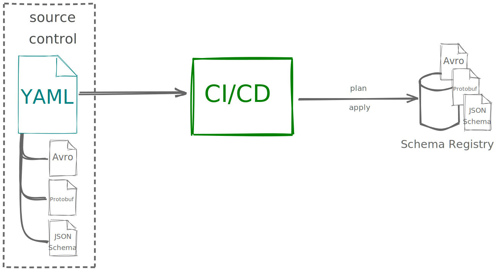

# EVENT SCHEMA REPOSITORY

## Overview

This is an example of a event schema repository to synchronize the schemas stored in gitlab with the schema registry.

To upload the schemas we will make use of a gitops tool the "Schema Registry
GitOps": (https://github.com/domnikl/schema-registry-gitops)

This is an Infrastructure as Code tool that applies a desired state configured through simple YAML and
Avro/Protobuf/JSON Schema files to a schema registry that allows you to maintain a version control history of your
schemas and validate, review, merge and evolve schemas in your CI/CD pipeline.



## State files: The base.yml

The desired state is managed using the following YAML schema:

```yaml
compatibility: BACKWARD
subjects:
  # a subject that links to a file for the schema definition
  - name: foo-event-value
    # sets compatibility level for this subject (optional)
    compatibility: NONE
    # file paths are always relative to the given (this) YAML file
    file: foo-event.json
    # AVRO is the default type and can safely be omitted (only available for Schema Registry >= 5.5)
    type: JSON
  - name: foo2-event-value
    # sets compatibility level for this subject (optional)
    compatibility: NONE
    # file paths are always relative to the given (this) YAML file
    file: foo2-event.json
    # AVRO is the default type and can safely be omitted (only available for Schema Registry >= 5.5)
    type: JSON
```

## How to run the CI/CD

By using the gitops tool the pipeline will execute these steps:

### Plan step

To see the changes the pipeline will execute the next command:

`java -jar schema-registry-gitops.jar -v -r=http://localhost:8081 plan base.yml`

### Apply step

To apply the changes the pipeline will execute the nex command:

`java -jar schema-registry-gitops.jar -v -r=http://localhost:8081 apply base.yml`
